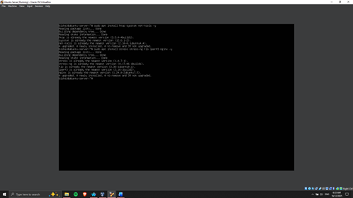

# Phase 2: Security Planning and Testing Methodology

## Security Baseline Design

A detailed **security baseline** determines the lowest security requirements of the server and provides uniformity and robustness to the server with regard to attacks. The **SSH hardening**, **firewall definition**, access control, automated security updates, and management of user privileges are some of the key elements of the baseline. This baseline can be used to check the level of compliance and also at which the level of extra security measures put in the further stages is checked [5].

## Performance Testing Plan

The method of performance testing is a process that entails observing the CPU, memory, disk I/O, and network performance under varying workloads. Remote monitoring is done through SSH and with scripts that gather metrics of the system every so often. Measurements of the unmodified system are measured as **baseline measurements**, and after measuring the measurements, the workload-based testing is applied to the CPU-intensive, memory-intensive, I/O intensive, network-intensive, and server applications. The testing plan records the steps, anticipated results, and performance guidelines so that they can be collected in a structured manner and analyzed quantitatively [6].

## Checklist of Security Configurations

A specific checklist will make sure that each security configuration will be uniformly applied and provable. Key items include:

*   Implementation of SSH authentication with the use of key-based authentication and the disabling of root login.
*   Setting of the **UFW firewall** to allow only the designated workstation.
*   Introducing compulsory access control with **AppArmor**.
*   Allowing automatic security updates in order to update vulnerabilities.
*   User privilege control and administrative access control.

## Threat Model and Mitigation Strategies

The following table summarizes the identified threats and their corresponding mitigation strategies:

| Threat | Mitigation Strategy | Citation |
| :--- | :--- | :--- |
| SSH Unauthorized Access | Reduced by firewall and key-based authentication. | |
| Brute-Force Attacks | Reduced with the help of **fail2ban** and tracking of failed attempts to log into the system. | [7] |
| Privilege Escalation | Mitigated with the help of **AppArmor**, least privilege policies, and the segregation of administrative users. | [8] |

> **Figure 3: Tools needed installed**
> 
> 

This step provides a structured base for ensuring that the server is secured and monitored in a structured environment and that the further configuration and testing phases are implemented on a reliable and well-documented base.

# Phase 3: Application Selection for Performance Testing

## Selection of Applications and Workload Types

The applications were pooled according to resource intensity to provide a systematic test of critical performance dimensions of the server.

| Workload Type | Application | Purpose |
| :--- | :--- | :--- |
| **CPU-Intensive** | `stress-ng` | To put in place large stressed capacities. |
| **Memory-based** | `memtester` | To test memory consumption. |
| **Network-Intensive** | `iperf3` | As a measure of network throughput. |
| **Server Application** | `Apache2` | To test the service performance on client requests. |

## Application Selection Matrix

*(Note: The content for the Application Selection Matrix was not provided in the source text. This section is included for structural completeness.)*

## Installation Documentation

All the chosen performance testing applications were installed on the Ubuntu Server via SSH. The installation of packages followed the **APT package manager**, and repositories have been updated, which provides a secure and reproducible deployment of all the necessary tools that are command-line-based.

> **Figure 4: Applications for performance testing installed**
>
> 

## Monitoring Strategy

System commands (`top`, `vmstat`, `iostat`, `netstat`) and SSH custom scripts will yield performance measurements as data on CPU, memory, disk, and network utilisation, as time goes by. This system of planning enables quality performance assessment that is also quantitative.

## Expected Resource Profiles

The predictable resource utilisation patterns should be produced with each application, which allows monitoring the performance and revealing the bottlenecks.

## References

[5]: Placeholder for Citation 5
[6]: Placeholder for Citation 6
[7]: Placeholder for Citation 7
[8]: Placeholder for Citation 8

