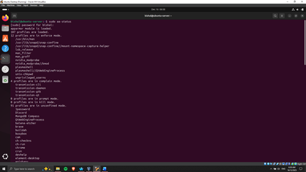
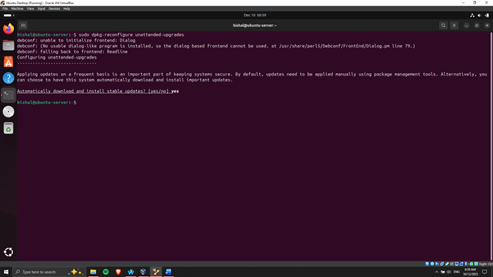
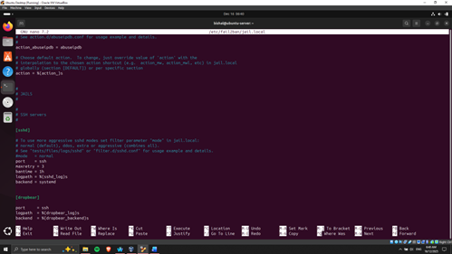
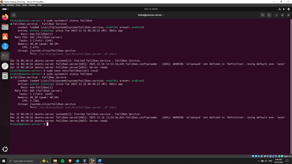
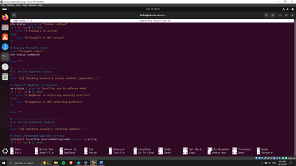
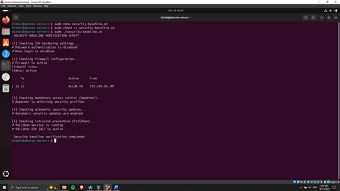
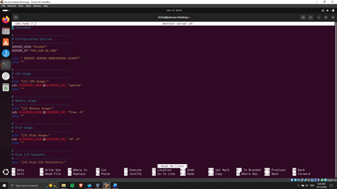

# Phase 5: Advanced Security and Monitoring Infrastructure

This phase greatly improves the security position and surveillance ability of the server and would offer it a solid base to perform the finer breakdown of performance appraisal in the following phase.

## Mandatory Access Control Implementation (AppArmor)

The access control framework made mandatory was **AppArmor**, which is an access control framework that blocks access to applications and imposes **least-privilege execution**. AppArmor profiles were also checked and updated to have services that were critical run within security limits. AppArmor status and profiles monitoring enable the administrator to identify violations of policy and possible security breaches [12].

> **Figure 10: AppArmor Status**
>
> 
> 

## Automatic Security Updates

**Automatic security updates** were established through the `unattended-upgrades` package to make sure vulnerabilities are patched in time. This setup will help to use critical security patches automatically, exposing the system to widespread exploits, and will preserve the stability of the system.

> **Figure 11: Automatic upgrades enabled**
>
> 
> 

## Intrusion Detection Using fail2ban 6.3

**Fail2ban** was also set up to block the SSH service against brute-force attacks by analyzing authentication logs and banning IP addresses that prove to be malicious by default. Another custom jail setup was done to match the SSH settings and security policies of the server.

> **Figure 12: Fail2ban Jail configured**
>
> 
>
> **Figure 13: Fail2ban running on Ubuntu Server**
>
>
>
> 
## Security Baseline Verification Script

A custom Bash script, `security-baseline.sh`, was written to check the security posture of the server automatically. The script verifies the SSH configuration options, firewall policies, AppArmor status, auto updates, and Fail2ban services. To record the intent and the functionality of each command, line-by-line comments were added.

> **Figure 14: Bash Script for security-baseline.sh**
>
> 
> 
>
> **Figure 15: Security baseline checked**
>
> 
> 

## Remote Monitoring Script

A remote script called `monitor-server` was written and run at the workstation to allow continuous monitoring of performance. The script is connected to the server through SSH, and it gathers key performance metrics such as CPU utilisation, memory utilisation, disk I/O, and network activity. This will guarantee non-intrusive monitoring and aid in the organization of data on the performance analysis.

> **Figure 16: Remote Server Monitoring Script**
>
> 
> 
>
> **Figure 17: Remote monitoring of Server**
>
> 
> 

